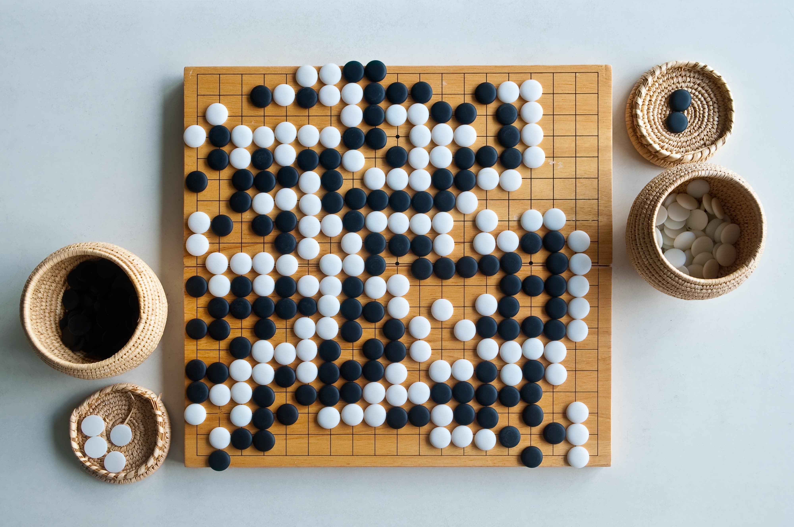
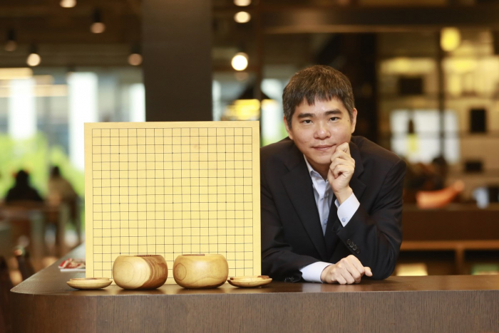

# কোর্স ও লেখক পরিচিতি

### <mark style="color:orange;">**লেখক**</mark> [<mark style="color:blue;">**হাবিব রহমান**</mark>](https://habibrahman.me) 

.jpeg>)

### <mark style="color:orange;">**লেখক পরিচিতি**</mark> 

আমি **হাবিব রহমান**। আমি বর্তমানে কানাডার **ইউনিভার্সিটি অফ আলবার্টা**য় **কম্পিউটিং সায়েন্স** বিষয়ে মাস্টার্সে অধ্যয়ন করছি। এখানে পড়াশুনা শুরু করার আগে আমি **স্যামসাং রিসার্চ এন্ড ডেভেলপমেন্ট ইন্সিটিউট** বাংলাদেশে **সফটওয়্যার ইঞ্জিনিয়ার** হিসেবে কর্মরত ছিলাম। তার আগে আমি **ইউনিভার্সিটি অফ ইনফর্মেশন টেকনোলজি এন্ড সায়েন্সস** এর কম্পিউটার সায়েন্স বিভাগে **লেকচারার** ও **প্রোগ্রামিং কন্টেস্ট মেন্টর** হিসেবে কাজ করি। আমি **রাজশাহী ইউনিভার্সিটি অফ ইঞ্জিনিয়ারিং এন্ড টেকনোলজি (রুয়েট)** থেকে ২০১৭ সালে **ব্যাচেলর অফ কম্পিউটার সায়েন্স এন্ড ইঞ্জিনিয়ারিং** ডিগ্রি অর্জন করি।

কম্পিউটার সায়েন্স এর একজন **শিক্ষার্থী, ইঞ্জিনিয়ার, ও শিক্ষক** হিসেবে আমার গবেষণার পছন্দ হল **মেশিন লার্নিং, সার্চ** ওর এর সাথে রিলেটেড বিষয় গুলো।

### <mark style="color:orange;">আর্টিফিশিয়াল ইন্টেলিজেন্স ও গো গেম সিরিজ</mark>  

**গো বা ওয়েইকি, ওয়েইচি** হল দুটি খেলোয়াড়ের জন্য একটি বিমূর্ত কৌশল বোর্ড খেলা যার লক্ষ্য প্রতিপক্ষের চেয়ে বেশি এলাকা ঘিরে রাখা। এই গেমটি অত্যন্ত বুদ্ধিদীপ্ত একটি খেলা। গেমটি 2,500 বছরেরও বেশি আগে চীনে আবিষ্কৃত হয়েছিল এবং বর্তমান দিন পর্যন্ত সবচেয়ে প্রাচীন বোর্ড গেম বলে মনে করা হয়। ইন্টারন্যাশনাল গো ফেডারেশনের 75টি সদস্য দেশ দ্বারা 2016 সালের একটি সমীক্ষায় দেখা গেছে যে সারা বিশ্বে 46 মিলিয়নেরও বেশি মানুষ আছে যারা গো খেলতে জানে এবং 20 মিলিয়নেরও বেশি বর্তমান খেলোয়াড়, যাদের অধিকাংশই পূর্ব এশিয়ায় বসবাস করে। [\[১\]](https://en.wikipedia.org/wiki/Go\_\(game\))

[<mark style="color:orange;">লি সেডল</mark>](https://en.wikipedia.org/wiki/Lee\_Sedol) হলেন একজন প্রাক্তন দক্ষিণ কোরিয়ার পেশাদার গো প্লেয়ার যার 9 ড্যান র‍্যাঙ্ক রয়েছে। রাঙ্কিং বিবেচনায় লি সেডল পৃথিবী বিখ্যাত একজন খেলোয়াড়। ২০১৬ সাল পর্যন্ত তাকে হারানোর মত খেলোয়াড় খুবি কম ছিল।&#x20;

2016 সালের মার্চ মাসে, তিনি [<mark style="color:orange;">আলফাগোর</mark>](https://deepmind.com/research/case-studies/alphago-the-story-so-far) বিরুদ্ধে একটি উল্লেখযোগ্য সিরিজ খেলেছিলেন যা **1-4** এ শেষ হয়েছিল। ৫ ম্যাচের এই সিরিজে তিনি মাত্র একটি গেম জিতেছিলেন।

\
\
**AlphaGo** হল একটি কম্পিউটার প্রোগ্রাম যা বোর্ড গেম Go খেলে। এটি **গুগলের** (বর্তমানে অ্যালফাবেট ইনকর্পোরেটেড) এর একটি সহযোগী প্রতিষ্ঠান **ডিপমাইন্ড টেকনোলজিস** দ্বারা তৈরি করা হয়েছিল। AlphaGo-এর পরবর্তী সংস্করণগুলি ক্রমশ শক্তিশালী হয়ে ওঠে, যার মধ্যে একটি সংস্করণ রয়েছে যা মাস্টার নামে প্রতিদ্বন্দ্বিতা করেছিল **লি সেডল** এর সাথে।

এই ৫ ম্যাচের সিরিজের AlphaGo এমন কিছু চাল দিয়েছিল যা কোন প্রোফেসনাল খেলোয়াড় দেয় না। সেই চালটি  **Move 37** নামে পরিচিত। এটি এমন একটি চাল ছিল, যা এর নির্মাতারা সাইন্টিস্টরাই বুঝতে পারে নাই। AlphaGo হল নিউরাল নেটওয়ার্ক এর একটি আপ্লিকেশন যা পৃথিবী বিখ্যাত গো খেলোয়াড় কে হারিয়েছে। AlphaGo ও লি সীডল এর সেই সিরিজের ডকুমেন্টারি পাওয়া যাবে **DeepMind** এর [<mark style="color:orange;">**ইউটিউবে**</mark>](https://youtu.be/WXuK6gekU1Y) **** চ্যানেল এ।&#x20;

### <mark style="color:orange;">প্রোগ্রাম সিন্থেসিস ও এক্সপ্লেনাবল আর্টিফিশিয়াল ইন্টেলিজেন্স</mark> 

আলফাগো এর Move 37 এর কোন ব্যাখ্যা সায়েন্টিস্টদের জানা ছিল না। আর্টিফিশিয়াল ইন্টেলিজেন্টেস এর যুগে নিউরাল নেটওয়ার্ক এর মত জটিল আল্গরিদম ব্যবহার প্রতি মুহূর্তেই বেড়ে চলছে। নিউরাল নেটওয়ার্ক মানুষের চালেঙ্গিং প্রব্লেম গুলো খুব সহজেই সল্ভ করে দিচ্ছে। কিন্তু মানুষের জন্যে এর সমাধান গুলো খুবি দুর্বোধ্য। এর জন্যেই এক্সপ্লেনাবল আর্টিফিশিয়াল ইন্টেলিজেন্স খুবি গুরুত্বপূর্ণ। **প্রোগ্রাম সিন্থেসিস** নিউরাল নেটওয়ার্ক দুর্বোধ ক্যাল্কুলেশন গুলা বুঝার জন্যে ব্যবহার করা হয়।

**প্রোগ্রাম সিন্থেসিস** এর মাধ্যমে ইউজার এর চাহিদা অনুসারে অটোমেটিক প্রোগ্রাম লেখা হয়। **** খুব সহজ করে বলতে গেলে, আমরা প্রোগ্রাম সিন্থেসিস দিয়ে নতুন নতুন প্রব্লেম সল্ভ করতে পারব কোন নতুন প্রোগ্রাম লেখা ছাড়াই। যেমন ধরা যাক,আমার কাছে কিছু ইনপুট ও আউটপুট স্যাম্পল আছে। এই স্যাম্পল এর উপর ভিত্তি করেই পুরা কোড অটোমেটিক দেখানই প্রোগ্রাম সিন্থেসিস এর কাজ।

এর মাধ্যমে আমরা দুর্বোধ্যে কাল্কুলেশন এর সহজ ও বোধগম্য প্রোগ্রাম জেনারেট করতে পারি। আর এই কারণেই প্রোগ্রাম সিন্থেসিস খুবি গুরুত্বপূর্ণ।

### <mark style="color:orange;">আলোচ্য বিষয়</mark> 

এই কোর্সে আমি প্রোগ্রাম সিন্থেসিস এর বিভিন্ন উপায়, আল্গরিদম, ও অ্যাপ্লিকেশান নিয়ে কথা বলব। এর টপিক গুলোকে নিম্নোক্ত তিনটি ক্যাটাগরিতে ভাগ করতে পারিঃ

* বেসিক
* গেম থিয়োরি ও প্রোগ্রাম সিন্থেসিস
* সার্চ ও লার্নিং
* অ্যাপ্লিকেশান

_**বর্তমানে বইটির কন্টেন্ট নানা রকম সোর্স থেকে সংগৃহীত এবং সংকলিত।**_&#x20;
